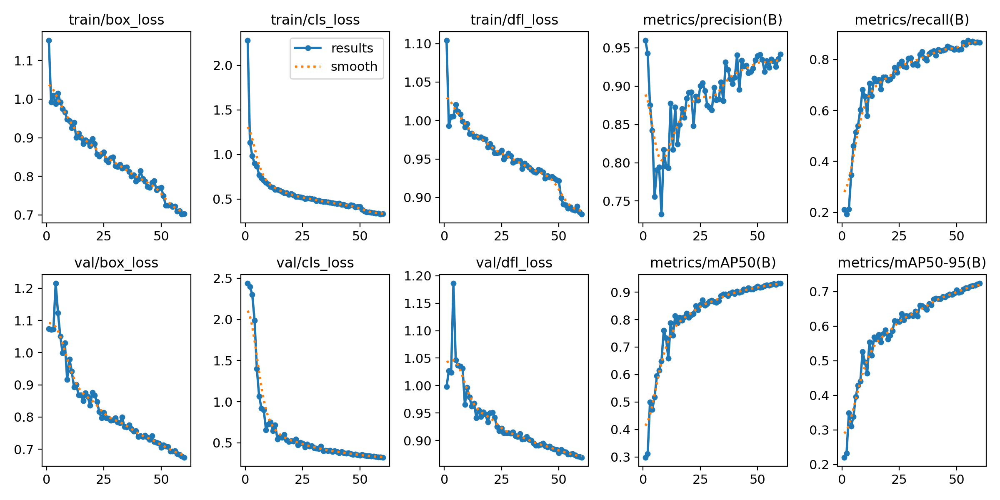
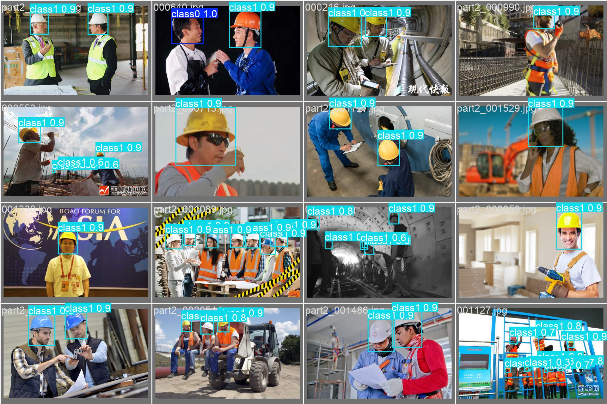
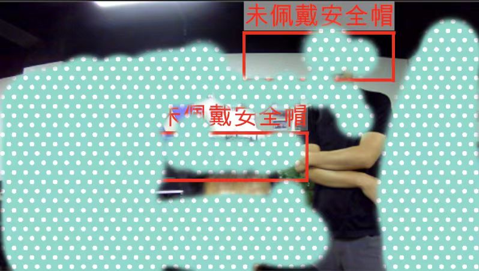

#The English version is below the page
# 基于Unity_Sentis的Yolo安全帽识别软件

 本篇README.md面向开发者
 
## 目录

- [简介](#简介)
  - [配置要求](#配置要求)
- [文件目录](#文件目录)
- [目录说明](#目录说明)
- [项目截图](#项目截图)
- [注意事项](#注意事项)
- [版本控制](#版本控制)
- [开发者](#开发者)


### 简介

本项目基于Unity官方最新的 AI 模型本地推理引擎 "Sentis" ，完成对Yolo识别模型的本地推理，并输出推理结果显示识别框。项目内预留接口支持替换自己训练的识别任意物体的onnx模型，包括YoloV8和V5模型。需要注意的是，项目默认使用的是YoloV8模型，使用V5模型需替换推理引擎为Sentis的旧版本：Barracuda引擎。项目支持移植web端、安卓端和iOS端。


 
###### 配置要求

1. Unity 2021.3.15f1 (使用c1版可能导致TextureProvider脚本内存泄漏);
2. Sentis 1.2.0-exp.2 (使用UnityPackageManager安装). 

### 文件目录
eg:

```
Assets 
├── Models
├── OtherAssets
├── Scenes
├── Scripts
  ├── TextureProvider
  └── Main

```

### 目录说明

Models：onnx模型文件夹；<br />
OtherAssets：包括识别框的Shader和盒子预制件等；<br />
Scenes：主场景文件夹（此项目仅有一个场景）；<br />
TextureProvider：为Yolo推理器提供画面的脚本，包括了Web端、安卓端、iOS端画面提供脚本；<br />
Main：Yolo推理核心代码。<br />

### 项目截图

安全帽识别模型训练结果如下图（使用开源安全帽训练集和验证集）
<br />
<br />
<h3 align="center">模型参数</h3>
<p align="center">

<br />
<h3 align="center">验证集识别结果</h3>
<p align="center">

<br />
<h3 align="center">Unity识别效果</h3>
<p align="center">

<br />
 
### 注意事项

1.相机画面渲染分辨率为 640*640；<br />
2.使用 NMS算法 以消除冗余框，可通过配置confThreshold和nmsThreshold参数控制抑制效果；<br />
3.textureProviderType参数无需手动设置；<br />
4.sentis的张量维度顺序为NHWC，Barracuda的顺序为NCHW，更改引擎时需要注意；<br />
5.输出结果列表根据置信度降序排序；<br />

### 版本控制

该项目使用Git进行版本管理。您可以在repository参看当前可用版本。

### 开发者

Github : mYoCaRdiA


# Yolo safety helmet recognition software based on Unity_Sentis
This README.md is aimed at developers

## Directory
- [Introduction](#Introduction)
- [Configurationrequirements](#Configurationrequirements)
- [Filedirectory](#Filedirectory)
- [CatalogDescription](#CatalogDescription)
- [Screenshotoftheproject](#Screenshotoftheproject)
- [Notes](#Notes)
- [Versioncontrol](#Versioncontrol)
- [Developers](#Developers)

### Introduction
This project is based on Unity's latest official AI model local inference engine "Sentis" to complete the local inference of Yolo recognition model, and output the inference results to display the recognition box. The in-project reserved interface supports replacing self-trained onnx models for recognizing arbitrary objects, including YoloV8 and V5 models. It should be noted that the project uses the YoloV8 model by default, and the V5 model needs to replace the old version of Sentis: Barracuda engine. The project supports porting web, Android and iOS.

### Configurationrequirements

Unity 2021.3.15f1 (using version c1 may cause memory leaks in TextureProvider script);
Sentis 1.2.0-exp.2 (installed using UnityPackageManager).

### Filedirectory
eg:

```
Assets 
├── Models
├── OtherAssets
├── Scenes
├── Scripts
  ├── TextureProvider
  └── Main

```

### CatalogDescription

Models: onnx models folder
OtherAssets: includes shaders for identifying boxes and box preforms, etc.
Scenes: the main scene folder (this project has only one scene)
TextureProvider: A script that provides a screen for the Yolo reasoner, including Web, Android, and iOS screen scripts.
Main: The Yolo inference core code

### Screenshotoftheproject
The training results of the safety helmet recognition model are shown below (using the open source safety helmet training set and validation set).


### Notes
1. The camera rendering resolution is 640*640;
2. Use the NMS algorithm to eliminate redundant boxes, and configure the confThreshold and nmsThreshold parameters to control the suppression effect.
3. The textureProviderType parameter does not need to be set manually;
4. The tensor dimension order of sentis is NHWC, and the order of Barracuda is NCHW, so pay attention when changing the engine;
The output list is sorted by confidence in descending order.

### Versioncontrol
The project uses Git for version management. You can see the currently available version in the repository.

### Developers
Github : mYoCaRdiA


